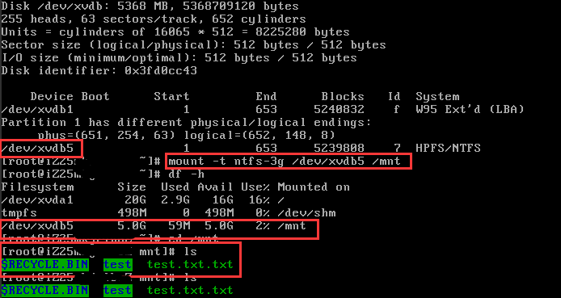
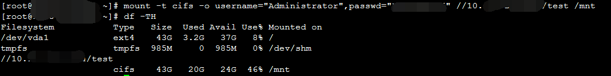

# 挂载 NTFS 格式的硬盘

> 背景： NTFS 作为 Windows 操作系统下主要的文件系统， 有时需要在 Linux 下读取 NTFS 文件系统中的数据。

## 方法一

### 安装 ntfs-3g 更好的读取 NTFS 格式中的数据

```bash
pacman -S ntfs-3g
```

### 挂载命令， 以 /dev/xx 挂载到 /mnt 中为例

```bash
mount -t ntfs-3g /dev/xx /mnt
```

### 开机自动挂载

- 在 /etc/fstab 下添加如下内容， 还是以 /dev/xx 为例

```conf
/dev/xx /mnt ntfs-3g ro,umask=0222, defaults 0 0
```



## 方法二

- 通过内网 IP 挂载 windows 系统共享目录
- 假定window IP 为 10.x.x.x 共享目录为 /test， 命令为

```bash
mount -t cifs -o username='Administrator',passwd='xxxxxxxx' //10.x.x.x/test /mnt
```



- 如果报错， 请确定 cifs 是否安装， 安装命令

```bash
pacman -S cifs-utils
```

## 具体作者和来自网址

- 作者：我是Mr小赵先生  
- 链接: <https://www.jianshu.com/p/0e95336b1405>
